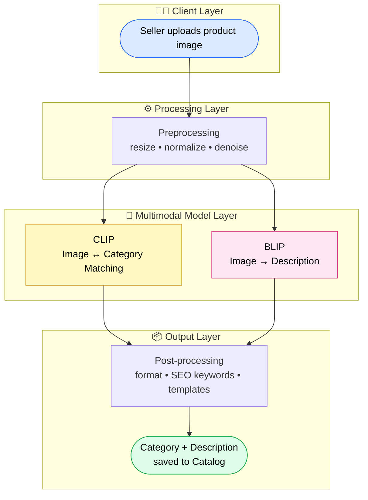
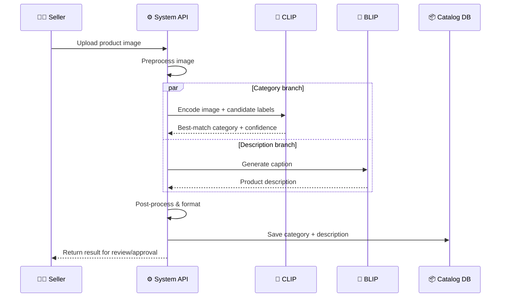
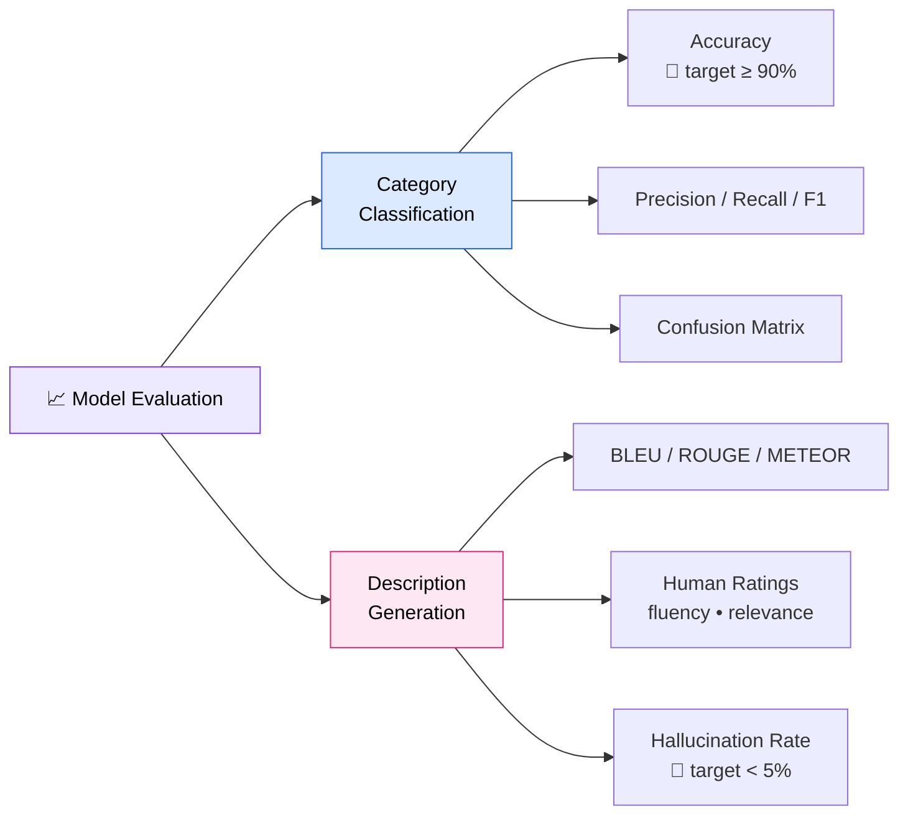

# 🛍️ Visual Catalog AI
### A Multimodal System that Turns a Product Photo into a Listing

**One image in → Category + Description out.**

`GEN AI Bootcamp · Day 1 Homework` · **Author:** _[Your Name]_ · **Domain:** E-Commerce (Amazon / Flipkart style)

---

> ### ⚡ TL;DR (30-second read)
> Sellers waste hours manually tagging and describing products. **Visual Catalog AI** takes a single product image and uses **CLIP** to predict the *category* and **BLIP** to generate a *sales-ready description* — automatically, at scale. Two specialized multimodal models, one clean pipeline, instant catalog data.

---

## 🎯 1. The Problem (Why this matters)
On large marketplaces, **millions** of products are uploaded by sellers who often skip or write poor titles, categories, and descriptions. This causes:

- ❌ **Bad discoverability** — wrong category → product never shows up in search.
- ❌ **Lost sales** — weak descriptions → lower buyer trust and conversion.
- ❌ **High manual cost** — humans tagging products doesn't scale.

**Goal:** From *just an image*, auto-generate the **category** and a **high-quality description** — no human writing required.

---

## 📥 2. Inputs & 📤 Outputs (The Data Contract)

| | Field | Type | Example |
|---|-------|------|---------|
| **Input** | Product image | `image (jpg/png)` | 📷 photo of a blue running shoe |
| **Output** | Category | `label (hierarchical)` | `Footwear > Sports > Running Shoes` |
| **Output** | Description | `text (1–3 sentences)` | *"Lightweight blue running shoes with breathable mesh and a cushioned sole — built for daily training and all-day comfort."* |

*Optional future inputs: brand text, multiple angles, price — to boost accuracy.*

---

## 🧠 3. Model Selection (The Core Decision)

The task needs a model that understands **vision + language together** → a **multimodal model**. No single model does both jobs best, so we use the *right tool for each output*:

| Model | Type | Strength | Our Use |
|-------|------|----------|---------|
| **CLIP** (OpenAI) | Contrastive (image ↔ text matching) | Zero-shot label matching, fast, no retraining | ✅ **Category prediction** |
| **BLIP / BLIP-2** | Generative (vision → language) | Fluent captioning & description | ✅ **Description generation** |

**Decision rationale:**
- 🔹 **CLIP** doesn't *write* text — it *matches*. Perfect for picking the closest category from a known list (zero-shot, so new categories need no retraining).
- 🔹 **BLIP** is *generative* — it produces natural sentences describing what it sees.
- 🔹 **Considered alternatives:** `LLaVA` / `GPT-4V` (more powerful but heavier & costlier); `ViT + classifier head` (accurate but needs labeled training data). **CLIP + BLIP** gives the best **accuracy-to-cost-to-effort** balance for Day 1.

---

## 🏗️ 4. System Design (Architecture)

### Layered View

### Request Flow (Sequence)

### Step-by-step
1. **Upload** → Seller submits a product image.
2. **Preprocess** → Resize, normalize, denoise.
3. **Classify (CLIP)** → Embed image, compare against category-label embeddings, pick top match + confidence.
4. **Describe (BLIP)** → Generate a fluent description from the image.
5. **Post-process** → Clean text, inject SEO keywords, apply brand template.
6. **Output** → Save to catalog; low-confidence cases routed for human review.

### 🛠️ Suggested Tech Stack
| Layer | Tools |
|-------|-------|
| Models | CLIP, BLIP-2 (Hugging Face `transformers`) |
| Serving | FastAPI / Flask + PyTorch |
| Frontend | React + Tailwind (upload UI) |
| Infra | Docker · GPU inference · Redis cache |
| Storage | S3 (images) · PostgreSQL (catalog) |

---

## ⚠️ 5. Edge Cases & Mitigations (Robustness)
| Risk | Mitigation |
|------|------------|
| Blurry / low-light image | Quality check → ask seller to re-upload |
| Multiple products in one photo | Object detection to crop the main item |
| Unknown / new category | Confidence threshold → flag for human review |
| Description hallucination | Constrain prompt + grounding checks |

---

## 📊 6. Evaluation (How we know it's good)

| Output | Metric | Target |
|--------|--------|--------|
| Category | Accuracy / F1 | ≥ 90% top-1 |
| Category | Confusion matrix | Spot confused pairs |
| Description | BLEU / ROUGE / METEOR | Overlap with human-written |
| Description | Human rating (fluency, relevance) | ≥ 4 / 5 |
| Description | Hallucination rate | < 5% |

---

## 💰 7. Business Value (The Impact)
| Benefit | Impact |
|---------|--------|
| ⏱️ **Time saved** | Listing time cut from minutes → seconds per product |
| 📈 **More sales** | Better categories + descriptions → higher search visibility & conversion |
| 🎯 **Consistency** | Uniform, SEO-friendly catalog at scale |
| 🚀 **Faster onboarding** | New sellers go live instantly |
| 💵 **Lower cost** | Replaces manual tagging across millions of listings |

---

## 🔮 8. Future Scope (Roadmap)
- Add **price suggestion** and **attribute extraction** (color, size, material).
- Support **multi-language** descriptions for global markets.
- Fine-tune on the platform's own catalog for domain accuracy.
- Upgrade to **GPT-4V / LLaVA** for richer, context-aware copy.

---

## ⭐ Bonus — Real-World Multimodal AI
- **🅰️ Amazon** — uses image + text signals for **"search by image" (Amazon Lens)** and automated product tagging to classify items and boost search relevance.
- **📌 Pinterest (Lens)** — matches a user's photo to visually similar **shoppable products**.
- **🔍 Google** — powers **Lens & Shopping** with multimodal models linking images to products and information.

---

## 💡 Key Takeaway
**CLIP understands + classifies. BLIP describes.**
Together they turn a single product photo into structured, sellable catalog data — automatically and at scale.

