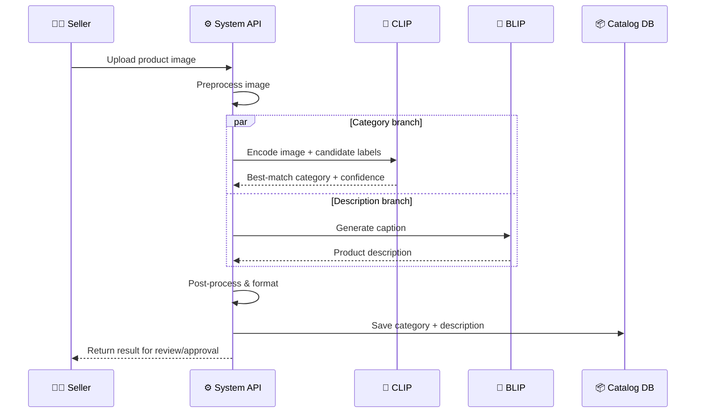
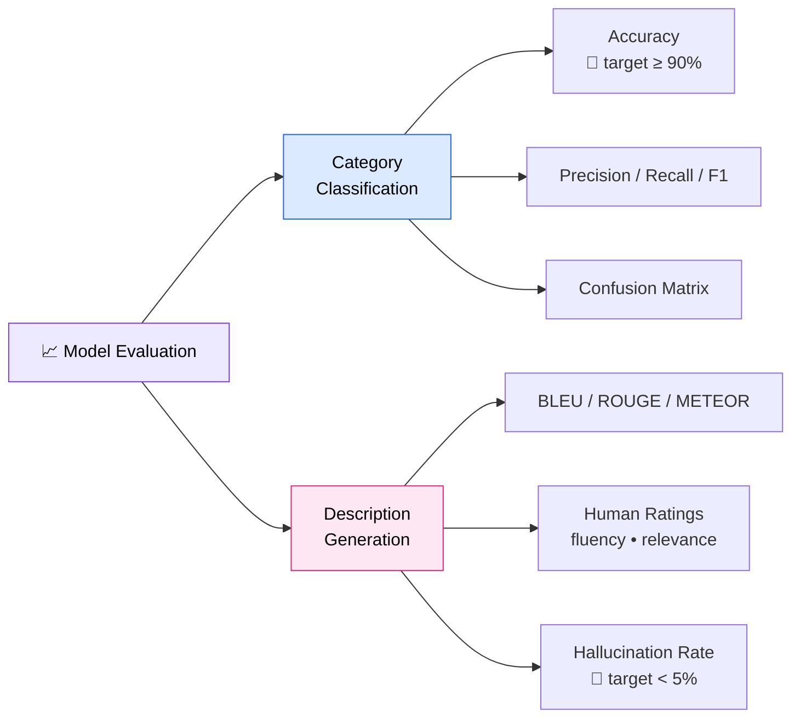

# 🛍️ Visual Catalog AI
### A Multimodal System that Turns a Product Photo into a Listing

**One image in → Category + Description out.**

`GEN AI Bootcamp · Day 1 Homework` · **Author:** Parth Amilkanthwar · **Domain:** E-Commerce (Amazon / Flipkart style)

---

> ### ⚡ TL;DR (30-second read)
> Sellers waste hours manually tagging and describing products. **Visual Catalog AI** takes a single product image and runs **CLIP** (category) and **BLIP** (sales-ready description) **in parallel**, returning both in **~200–400 ms** on GPU. Two specialized multimodal models, one clean pipeline, instant catalog data at scale.

---

## 🎯 1. The Problem (Why this matters)
On large marketplaces, **millions** of products are uploaded by sellers who often skip or write poor titles, categories, and descriptions. This causes:

- ❌ **Bad discoverability** — wrong category → product never shows up in search.
- ❌ **Lost sales** — weak descriptions → lower buyer trust and conversion.
- ❌ **High manual cost** — humans tagging products doesn't scale.

**Goal:** From *just an image*, auto-generate the **category** and a **high-quality description** — no human writing required.

---

## 📥 2. Inputs & 📤 Outputs (The Data Contract)

| | Field | Type | Example |
|---|-------|------|---------|
| **Input** | Product image | `image (jpg/png)` | 📷 photo of a blue running shoe |
| **Output** | Category | `label (hierarchical)` | `Footwear > Sports > Running Shoes` |
| **Output** | Description | `text (1–3 sentences)` | *"Lightweight blue running shoes with breathable mesh and a cushioned sole — built for daily training and all-day comfort."* |

*Optional future inputs: brand text, multiple angles, price — to boost accuracy.*

---

## 🧠 3. Model Selection (The Core Decision)

The task needs a model that understands **vision + language together** → a **multimodal model (VLM)**. There's a whole landscape to choose from — CLIP/BLIP are just the classic entry point. Below is the wider menu, grouped by job:

### 🏆 The Model Landscape
| Model | Type | Best at | Cost / Effort |
|-------|------|---------|---------------|
| **GPT-4o** (OpenAI) | Large VLM (API) | Top-quality category **+** description in one call | 💰💰 API cost, zero setup |
| **Gemini 1.5 / 2.0** (Google) | Large VLM (API) | Strong reasoning, long context, both outputs | 💰💰 API cost |
| **Claude 3.5 Sonnet** (Anthropic) | Large VLM (API) | Detailed, well-structured descriptions | 💰💰 API cost |
| **Qwen2-VL / LLaVA-1.6** | Open-source VLM | Self-hosted, both outputs, customizable | 💰 GPU, full control |
| **CLIP** (OpenAI) | Contrastive matcher | ⚡ Fast zero-shot **category** matching | 🆓 cheap, lightweight |
| **BLIP / BLIP-2** | Generative captioner | Lightweight **description** generation | 🆓 cheap, open-source |

### ✅ Decision: CLIP + BLIP (committed architecture)
**I commit to a two-model specialized pipeline: CLIP for category, BLIP for description.** This is the architecture used in *every* diagram, metric, and latency estimate below — no hedging.

**Why this over a single large VLM (GPT-4o / Gemini)?** At Amazon/Flipkart scale, the system runs on **millions of uploads/day**, so latency and per-call cost dominate the decision:

| Factor | ✅ CLIP + BLIP (chosen) | Large VLM (GPT-4o, etc.) |
|--------|------------------------|--------------------------|
| Latency | **~200–400 ms** on GPU (local) | ~2–3 s per API round-trip |
| Cost | **~free** after self-hosting | Per-image API fee × millions |
| Control / privacy | **Full** (weights on-prem) | Data leaves to 3rd-party API |
| Quality | Strong, sufficient for catalog | Slightly higher, but overkill |

**Where large VLMs still fit (not the primary architecture):** a **bootstrap/cold-start tier** — use GPT-4o once to *auto-generate the training/eval labels*, then run CLIP+BLIP in production. They are an offline data tool, **not** part of the live request path.

**Why these two specifically?**
- 🔹 **CLIP** *matches* an image to the closest category label (zero-shot → new categories need no retraining).
- 🔹 **BLIP** *generates* a fluent description from the image.
- A text-only or image-only model can't link *what it sees* to *what it writes*; both CLIP and BLIP share a vision+language space, so together they cover classification **and** description.

---

## 🏗️ 4. System Design (Architecture)

### Layered View

### Request Flow (Sequence)

### Step-by-step
1. **Upload** → Seller submits a product image.
2. **Preprocess** → Resize, normalize, denoise.
3. **Classify (CLIP)** → Embed image, match against category-label embeddings, pick top label + confidence score.
4. **Describe (BLIP)** → Generate a fluent product description from the image.
5. **Post-process** → Clean text, inject SEO keywords, apply brand template.
6. **Output** → Save to catalog; low-confidence cases routed for human review.

### 🛠️ Suggested Tech Stack
| Layer | Tools |
|-------|-------|
| Models | CLIP + BLIP-2 (Hugging Face `transformers`, PyTorch) |
| Serving | FastAPI / Flask + PyTorch |
| Frontend | React + Tailwind (upload UI) |
| Infra | Docker · GPU inference · Redis cache |
| Storage | S3 (images) · PostgreSQL (catalog) |

---

## ⚠️ 5. Edge Cases & Mitigations (Robustness)
| Risk | Mitigation |
|------|------------|
| Blurry / low-light image | Quality check → ask seller to re-upload |
| Multiple products in one photo | Object detection to crop the main item |
| Unknown / new category | Confidence threshold → flag for human review |
| Description hallucination | **Post-generation grounding check** — filter BLIP's output against visual attributes detected in the image (drop claims not supported by what's seen) |

---

## 📊 6. Evaluation (How we know it's good)

### 📂 Evaluation Datasets
The **90% target only means something against a named benchmark**. I'd evaluate on real product-catalog data:

| Dataset | What it offers | Used for |
|---------|----------------|----------|
| **Amazon Berkeley Objects (ABO)** | ~147K real product listings with images + category + metadata; **released by Amazon itself**, making it the most credible benchmark for this exact use case | Primary benchmark (category accuracy) |
| **Fashion Product Images (Kaggle, ~44K)** | Product photos labeled by category, sub-category, color | Apparel category eval |
| **Stanford Online Products (SOP)** | ~120K e-commerce product images | Retrieval / matching sanity checks |
| **Amazon Reviews 2023 (metadata)** | Real seller titles + descriptions | Reference text for BLEU/ROUGE on descriptions |

**Protocol:** hold out a stratified **test split** (so rare categories are represented), report metrics per-category, and use the real human-written descriptions in these datasets as the *reference text* for BLEU/ROUGE/METEOR.

| Output | Metric | Target |
|--------|--------|--------|
| Category | Accuracy / F1 | ≥ 90% top-1 |
| Category | Confusion matrix | Spot confused pairs |
| Description | BLEU / ROUGE / METEOR | Overlap with human-written |
| Description | Human rating (fluency, relevance) | ≥ 4 / 5 |
| Description | Hallucination rate | < 5% |

---

## 💰 7. Business Value (The Impact)
| Benefit | Impact |
|---------|--------|
| ⏱️ **Time saved** | Listing time cut from minutes → seconds per product |
| ⚡ **Real-time latency** | **~200–400 ms** per image on GPU → fits live upload flow (vs ~2–3 s for a VLM API) |
| 📈 **More sales** | Better categories + descriptions → higher search visibility & conversion |
| 🎯 **Consistency** | Uniform, SEO-friendly catalog at scale |
| 🚀 **Faster onboarding** | New sellers go live instantly |
| 💵 **Lower cost** | Replaces manual tagging across millions of listings |

---

## 🔮 8. Future Scope (Roadmap)
- Add **price suggestion** and **attribute extraction** (color, size, material).
- Support **multi-language** descriptions for global markets.
- Fine-tune CLIP & BLIP on the platform's own catalog for domain accuracy.
- **Active-learning loop** — feed low-confidence / human-corrected cases back into training.
- **Multi-image + attribute extraction** — combine angles to pull color, size, material.
- **Edge inference** — distil/quantize models for on-device seller-app tagging.

---

## ⭐ Bonus — Real-World Multimodal AI
- **🅰️ Amazon** — uses image + text signals for **"search by image" (Amazon Lens)** and automated product tagging to classify items and boost search relevance.
- **📌 Pinterest (Lens)** — matches a user's photo to visually similar **shoppable products**.
- **🔍 Google** — powers **Lens & Shopping** with multimodal models linking images to products and information.

---

## 💡 Key Takeaway
**CLIP understands + classifies. BLIP describes.**
Together they turn a single product photo into structured, sellable catalog data — automatically and at scale.

